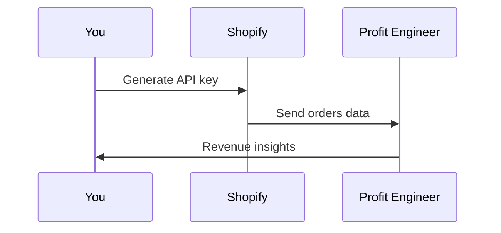

## Overview

Connect Profit Engineer to your data sources to enable automated analysis of marketing performance, revenue attribution, and profit optimization. Integrations pull data daily, so you receive actionable insights without manual exports.

Profit Engineer supports native connections to major ad platforms, e-commerce stores, CRMs, and accounting tools. Use the dashboard at `https://dashboard.profitengineer.ai/integrations` to set up connections.

<Callout kind="info">
  Enable at least one ad platform and e-commerce integration for full profit attribution.
</Callout>

## Supported Integrations

Browse available integrations by category.

<Columns cols={2}>
  <Card title="Ad Platforms" icon="zap" href="#ad-platforms">
    Connect Meta Ads and Google Ads for spend and performance data.
  </Card>
  <Card title="E-commerce" icon="shopping-cart" href="#ecommerce">
    Sync Shopify orders and revenue automatically.
  </Card>
  <Card title="CRM & Sales" icon="users" href="#crm">
    Import customer data from HubSpot or Salesforce.
  </Card>
  <Card title="Accounting" icon="dollar-sign" href="#accounting">
    Link QuickBooks for expense and profit tracking.
  </Card>
</Columns>

## Ad Platform Connections

Set up ad integrations to track campaign profitability.

<Tabs>
  <Tab title="Meta Ads" icon="facebook">
    <Steps>
      <Step title="Get API Access" icon="key">
        In Meta Business Manager, generate an access token with `ads_read` permission.
      </Step>
      <Step title="Connect in Dashboard">
        Paste your token into Profit Engineer settings.
      </Step>
      <Step title="Verify Sync">
        Check daily data pulls in the integrations log.
      </Step>
    </Steps>
  </Tab>
  <Tab title="Google Ads" icon="google">
    <Steps>
      <Step title="Enable API" icon="settings">
        Create a developer token in Google Ads.
      </Step>
      <Step title="Authorize">
        Use OAuth to grant Profit Engineer read access.
      </Step>
    </Steps>
  </Tab>
</Tabs>

## E-commerce Sync

For Shopify, connect in minutes.



<Steps>
  <Step title="Install App" icon="download">
    Add the Profit Engineer app from the Shopify App Store.
  </Step>
  <Step title="Grant Permissions">
    Allow access to orders and products.
  </Step>
  <Step title="Test Connection">
    Run a sync test to confirm data flow.
  </Step>
</Steps>

## CRM and Accounting Integrations

### CRM Setup

Connect HubSpot or similar via API key.

<ParamField query="api_key" param-type="string" required="true">
  Your CRM API key for customer data import.
</ParamField>

<ParamField header="Authorization" param-type="string" required="true">
  Bearer `{YOUR_API_TOKEN}` for authenticated requests.
</ParamField>

Example webhook setup:

<CodeGroup tabs="JavaScript,Python">
  ```javascript
  const webhook = await fetch('https://api.example.com/webhooks', {
    method: 'POST',
    headers: { 'Authorization': 'Bearer YOUR_TOKEN' },
    body: JSON.stringify({
      url: 'https://your-webhook-url.com/crm',
      events: ['customer.created', 'deal.won']
    })
  });
  ```
  ```python
  import requests
  response = requests.post('https://api.example.com/webhooks',
    headers={'Authorization': 'Bearer YOUR_TOKEN'},
    json={
      'url': 'https://your-webhook-url.com/crm',
      'events': ['customer.created', 'deal.won']
    })
  ```
</CodeGroup>

### Accounting with QuickBooks

Use OAuth for secure access to invoices and expenses.

## Data Import Best Practices

Follow these tips for reliable data.

<Expandable title="Advanced Import Options" default-open="false">
  Use CSV uploads for custom sources. Format columns as `date`, `channel`, `spend`, `revenue`.

  <Request tabs="cURL">
  ```
  curl -X POST https://api.example.com/imports \
    -H "Authorization: Bearer YOUR_API_KEY" \
    -F "file=@data.csv"
  ```
  </Request>
</Expandable>

<Callout kind="tip">
  Sync daily and avoid backfilling more than 90 days to prevent rate limits.
</Callout>

<Board title="Integration Status">
  <BoardColumn title="Connected" color="2" icon="check-circle">
    <BoardCard title="Meta Ads" description="Daily sync active" icon="facebook" />
    <BoardCard title="Shopify" description="Orders importing" icon="shopping-cart" />
  </BoardColumn>
  <BoardColumn title="Pending" color="1" icon="loader">
    <BoardCard title="Google Ads" dueDate="2024-12-15" />
    <BoardCard title="QuickBooks" author="You" />
  </BoardColumn>
  <BoardColumn title="Planned" color="0" icon="circle-dot">
    <BoardCard title="Klavyio Email" icon="mail" />
  </BoardColumn>
</Board>