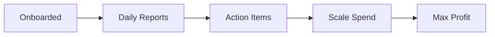

## Prerequisites

<Callout kind="info">

Before starting, ensure you have:

- Access to your marketing ad accounts (Meta Ads, Google Ads, etc.)
- Admin permissions for data connections
- A business email address for account creation

Profit Engineer analyzes your real marketing data to provide actionable profit insights.

</Callout>

## Create Your Account

Sign up in under 2 minutes to access your personalized Profit Engineer dashboard.

<Steps>
  <Step title="Visit the Dashboard" icon="monitor">
    Navigate to `https://dashboard.profitengineer.ai` and click **Sign Up**.

    Select your preferred method:
  </Step>
  <Step title="Choose Sign-Up Method">
    <Tabs>
      <Tab title="Email" icon="mail">
        Enter your business email and create a secure password.
        
        Verify your email via the confirmation link sent immediately.
      </Tab>
      <Tab title="Google" icon="chrome">
        Click **Continue with Google** and authorize the secure connection.
        
        No additional passwords needed.
      </Tab>
    </Tabs>
  </Step>
  <Step title="Complete Login">
    Return to the dashboard and log in with your new credentials.
    
    You'll land on the onboarding wizard automatically.
  </Step>
</Steps>

## Run the Onboarding Wizard

The wizard guides you through initial setup for your first profit report.

<Steps>
  <Step title="Connect Data Sources" icon="database">
    Select your primary platforms:
    
    <Tabs>
      <Tab title="Meta Ads" icon="facebook">
        Paste your `{PIXEL_ID}` and `{ACCESS_TOKEN}` from Meta Business Manager.
        
````javascript
// Example Meta connection config
{
  pixelId: "123456789012345",
  accessToken: "YOUR_META_ACCESS_TOKEN"
}
````
      </Tab>
      <Tab title="Google Ads" icon="search">
        Enter your `{CUSTOMER_ID}` and grant OAuth access.
        
````javascript
// Example Google Ads connection
{
  customerId: "123-456-7890",
  developerToken: "YOUR_DEVELOPER_TOKEN"
}
````
      </Tab>
    </Tabs>

    <Callout kind="tip">
      Start with one source for quickest insights. Add more later.
    </Callout>
  </Step>
  <Step title="Set Profit Targets" icon="trending-up">
    Input your key metrics:
    
    | Metric | Example Value | Description |
    |--------|---------------|-------------|
    | Target ROAS | `4.5` | Return on ad spend goal |
    | Avg. Order Value | `$85` | Typical customer purchase |
    | Customer Acquisition Cost | `< $50` | Max spend per new customer |
    
    Click **Save and Analyze**.
  </Step>
  <Step title="Generate First Report" icon="zap">
    Wait 1-2 minutes while Profit Engineer processes your data.
    
    Receive your first daily profit summary via email and dashboard.
  </Step>
</Steps>

## Review Your First Profit Report

Your dashboard shows clear, plain-English insights.

- **Profit Kept This Week**: e.g., `$18,240` (▲ 22% vs. last week)
- **Cost Per Customer**: e.g., `$41` (▼ $7 this week)
- **Action Items**: Specific moves like "Move `$1,500/day` from retargeting to prospecting"

<Expandable title="Common Report Metrics" default-open="true">
  
  Reports highlight:
  
  - Top-performing channels (e.g., Meta: `+$9,400` profit)
  - Bleeding campaigns to pause
  - Budget shifts for `+$2,100` projected gain
  
</Expandable>

## Navigate the Dashboard

<Columns cols={3}>
  <Card title="Daily Insights" icon="activity" href="/dashboard-insights">
    View profit summaries and weekly trends.
  </Card>
  <Card title="Action Center" icon="zap" href="/actions">
    Get your one key move each week.
  </Card>
  <Card title="Data Sources" icon="database" href="/data-sources">
    Manage connections and add new platforms.
  </Card>
</Columns>

## Next Steps

<Callout kind="success">
  Congratulations! You're now engineering profits with AI-driven insights.
</Callout>

Explore advanced features:



<Board title="Your Profit Roadmap">
  <BoardColumn title="Now" color="2" icon="check-circle">
    <BoardCard title="Review First Report" description="Check email and dashboard" createdAt="2024-10-15" />
  </BoardColumn>
  <BoardColumn title="Today" color="1" icon="loader">
    <BoardCard title="Implement Actions" description="Shift budgets as recommended" dueDate="2024-10-16" />
  </BoardColumn>
  <BoardColumn title="Next" color="0" icon="circle-dot">
    <BoardCard title="Add More Sources" description="Connect Google Ads or email" />
    <BoardCard title="Set Alerts" description="Notify on profit drops" />
  </BoardColumn>
</Board>